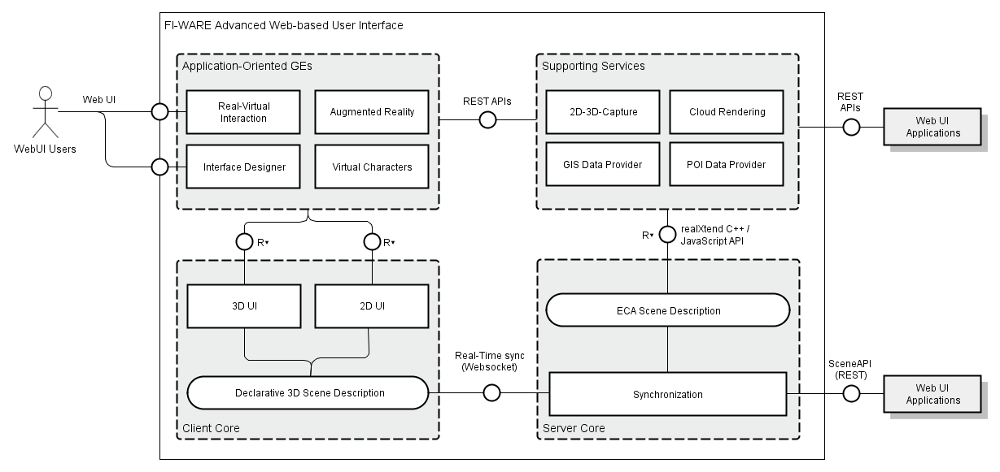

## **SpeedUP & FIWARE WebUI**

- Toni Alatalo &lt;toni@playsign.net&gt;
- Playsign Ltd., Oulu, Finland
- +358-40-7198759

!

## Outline of the session

1. Introduction
 - Playsign & Demos of WebUI GEs in use
2. Closer look at the WebUI chapter whole
3. How to do this yourself?
4. Simplest way to test
 - standalone local Javascript for 3D
 - whatever server, locally & in normal VM
5. Questions, or about dev process and practices
 - and I'm addicted to <a href="http://www.quora.com/">Quora</a> :)

!

## FIDEMO - WebUI & Context Broker

- buildings automatically from map data (GIS/OSM)
- real-time public traffic data (from the transit company)
- cafes, shops etc. (also from Openstreetmaps (OSM))
- Open311 issues from Context Broker (‘fix the city’ in HKI)
- Building prices (Finnish Statistics Open Data)
- adding comments to POIs to Context Broker (Orion)

!

!

## How to do self?

- For a multi-user game or other application, a minimal example:
 - <a
 href="https://forge.fiware.org/plugins/mediawiki/wiki/fiware/index.php/3D-UI_-_WebTundra_-_User_and_Programmers_Guide#Pong_Example">
 3D-UI WebTundra - User and Programmers Guide, Pong Example
</a>

!

## Simple way to try 3D Web

- Get <a href="http://threejs.org/">three.js</a>
- Have local web dev env
 - http server (Apache, Python, IIS, ..)
 - or start chrome with <a href="http://www.chrome-allow-file-access-from-file.com/">--allow-file-access-from-files</a>
- Use an example as a starting point
- Use any VM / server hosting to publish on the web
- Or e.g. Google App Engine

!

##Questions?

##Comments?
